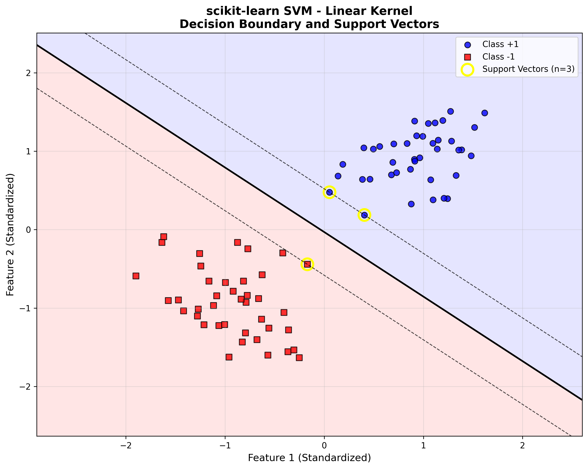
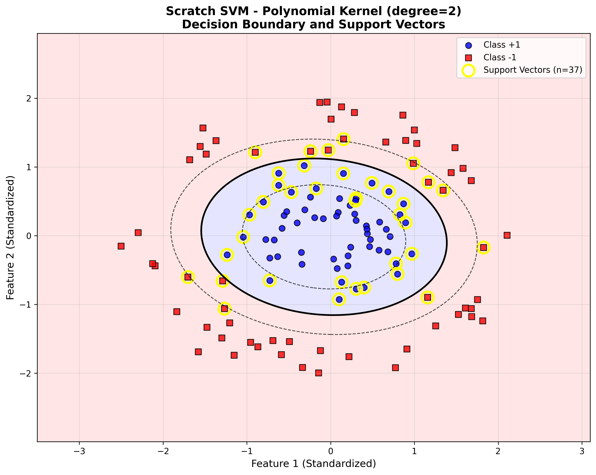
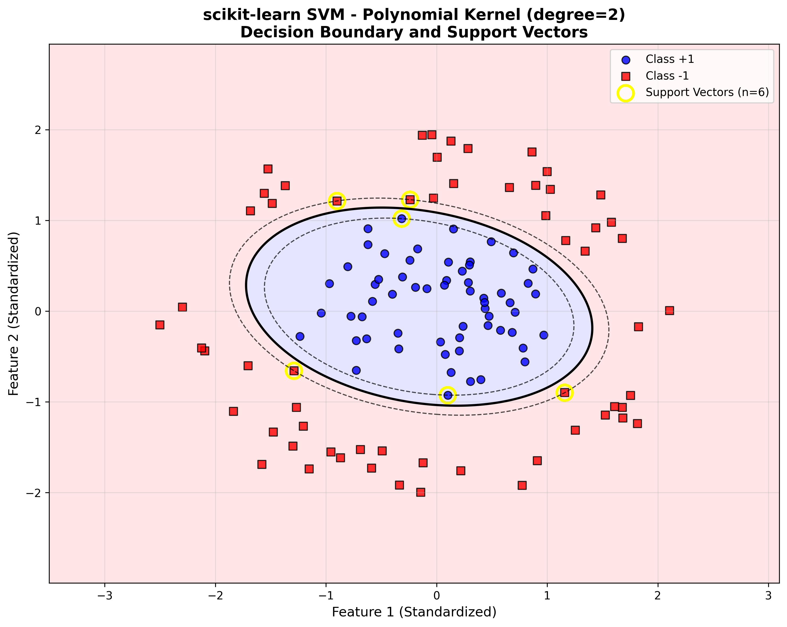
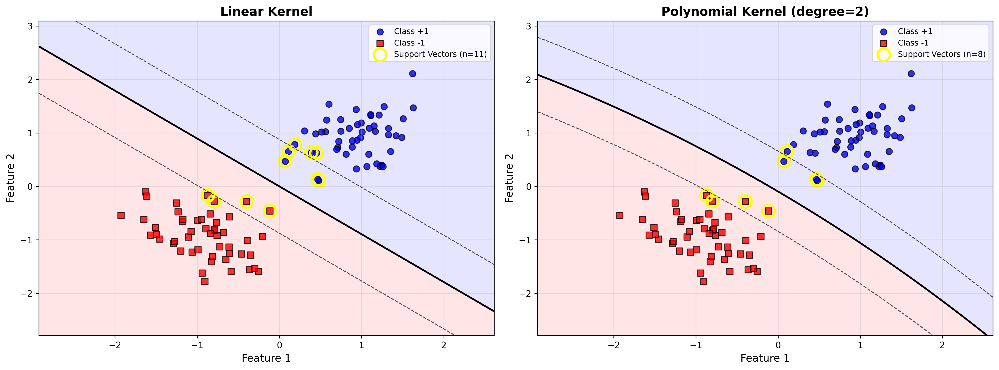

# SVM from Scratch Assignment

---

### **Purpose**
- Understand Support Vector Machine (SVM) through scratch implementation.
- Learn Lagrange's undetermined multiplier method with gradient descent.
- Touch a method different from linear models.
- Implement kernel functions (linear and polynomial).
- Compare scratch implementation with scikit-learn.

---

### **Problem Description**
- Support Vector Machines (SVMs) find the optimal hyperplane that maximizes the margin between classes.
- We implement **hard margin SVM** using Lagrange's undetermined multiplier method.
- The dual formulation allows us to use the **kernel trick** for non-linear classification.
- This assignment uses only NumPy for the core implementation.

---

## Assignments

### **[Problem 1] Lagrange's Steepest Descent by Undetermined Multiplier Method**
- Implement gradient descent optimization on Lagrange multipliers λ.
- Update rule: **λᵢ^new = λᵢ + α(1 - Σⱼλⱼ·yᵢ·yⱼ·K(xᵢ,xⱼ))**
- Enforce constraint: **λᵢ ≥ 0** (if negative, set to 0)
- Implement linear kernel: **K(xᵢ, xⱼ) = xᵢᵀ · xⱼ**

**Output:** Trained SVM with optimized Lagrange multipliers.  
**File:** `scratch_svm.py` - `fit()` method and `_linear_kernel()` method

---

### **[Problem 2] Support Vector Determination**
- Identify support vectors where **λᵢ > threshold**.
- Threshold hyperparameter (start with 1e-5).
- Store as instance variables:
  - `n_support_vectors` - Number of support vectors
  - `index_support_vectors` - Support vector indices
  - `X_sv` - Support vector features
  - `lam_sv` - Support vector Lagrange multipliers
  - `y_sv` - Support vector labels

**Output:** Support vector identification and storage.  
**File:** `scratch_svm.py` - `_determine_support_vectors()` method

---

### **[Problem 3] Estimation (Prediction)**
- Implement prediction using support vectors.
- Decision function: **f(x) = Σₙ λₙ·y_svₙ·K(x, sₙ)**
- Classification: **ŷ = sign(f(x))**

**Output:** Predicted labels for test samples.  
**File:** `scratch_svm.py` - `predict()` method

---

### **[Problem 4] Learning and Estimation**
- Test on **Simple Dataset 1** (from Machine Learning Scratch Sprint).
- Binary classification with labels **-1 and +1**.
- Compare with scikit-learn SVM implementation.
- Calculate metrics: **Accuracy, Precision, Recall**.

**Output:** Performance comparison with sklearn.  
**File:** `test_svm.py`  
**Saved to:** `reports/test_results_*.txt`

---

### **[Problem 5] Visualization of Decision Area**
- Visualize decision boundaries.
- **Show support vectors in different colors** (as in assignment example).
- Plot decision regions and margins.

**Output:** Decision boundary plot with highlighted support vectors.  
**File:** `visualize_svm.py`  
**Saved to:** `plots/decision_boundary.png`

---

### **[Problem 6] (Advanced) Creation of Polynomial Kernel Function**
- Implement polynomial kernel: **K(xᵢ, xⱼ) = (γ·xᵢᵀ·xⱼ + θ₀)^d**
- Hyperparameters: γ (gamma), θ₀ (theta_0), d (degree)
- Note: Linear kernel is a special case (γ=1, θ₀=0, d=1)

**Output:** Polynomial kernel implementation for non-linear classification.  
**File:** `scratch_svm.py` - `_polynomial_kernel()` method

---

### **Tools Used**
- **Python 3.7+**
- **NumPy** - Numerical computations (minimum library)
- **Matplotlib** - Visualization of decision areas
- **scikit-learn** - Comparison and metrics calculation

---

### **How to Run**

#### **Installation**
```bash
# Install required packages
pip install -r requirements.txt
```

#### **Run Tests (Problem 4)**
```bash
# Test on Simple Dataset 1 and compare with sklearn
python test_svm.py
```
**Output:**
- Performance metrics (Accuracy, Precision, Recall)
- Comparison with scikit-learn
- Report saved to `reports/test_results_YYYYMMDD_HHMMSS.txt`

#### **Generate Visualization (Problem 5)**
```bash
# Visualize decision area with support vectors
python visualize_svm.py
```
**Output:**
- Decision boundary plot with support vectors highlighted
- Saved to `plots/` folder

#### **Use in Your Own Code**
```python
from scratch_svm import ScratchSVMClassifier
from sklearn.preprocessing import StandardScaler

# Prepare data (labels must be -1 and +1)
scaler = StandardScaler()
X_train_scaled = scaler.fit_transform(X_train)

# Train SVM
svm = ScratchSVMClassifier(num_iter=100, lr=0.01, kernel='linear')
svm.fit(X_train_scaled, y_train)

# Predict
predictions = svm.predict(X_test_scaled)
```

---

### **Expected Results**

**Simple Dataset 1 (Binary Classification)**:
- Test Accuracy: **90-100%**
- Support Vectors: Small subset of training data
- Should match scikit-learn SVM results closely

---

### **Results & Visualizations**

#### **Problem 5: Decision Boundary Visualization**

**Scratch SVM (Linear Kernel)**  


**scikit-learn SVM (Linear Kernel)**  


#### **Problem 6: Polynomial Kernel (Advanced)**

**Scratch SVM (Polynomial Kernel)**  


**scikit-learn SVM (Polynomial Kernel)**  


#### **Kernel Comparison**

**Linear vs Polynomial Kernel**  


---

### **Files Structure**

```
svm-from-scratch/
├── scratch_svm.py              # Core SVM implementation (Problems 1-3, 6)
├── simple_dataset.py           # Dataset generation (Simple Dataset 1)
├── test_svm.py                 # Testing and comparison (Problem 4)
├── visualize_svm.py            # Decision area visualization (Problem 5)
├── requirements.txt            # Python dependencies
├── README.md                   # This file
├── .gitignore                  # Git ignore rules
├── plots/                      # Decision boundary plots
└── reports/                    # Test results and metrics
```

---

### **Important Notes**

- ⚠️ **Hard Margin SVM**: This implementation uses hard margin (no slack variables)
- 📊 **Labels must be -1 and +1** (not 0 and 1) for proper SVM formulation
- 🔧 **Threshold**: Start with 1e-5 for support vector identification
- 📈 **Support vectors**: Will be highlighted in visualization (Problem 5)

---

## Author

**Assignment:** SVM from Scratch - Machine Learning Sprint

**Name:** Victor Karisa

**Date:** 25/10/2025

**Repository:** `svm-from-scratch`

**Status:** ✅ Complete - All 6 problems solved (including Problem 6 - Advanced)

